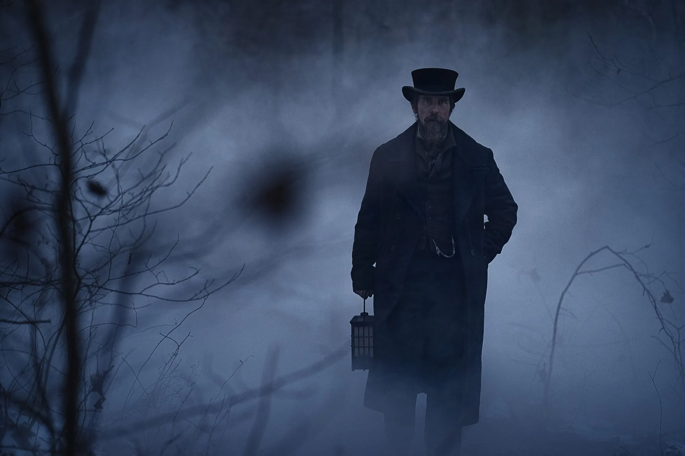

# Workshop 4

By: Duha Khan

## Emphasis

The gunshot echoed, a stark interruption in the early morning quiet. *Officer Leroy* turned sharply, heart pounding in his chest, knowing that a life might have just been *irrevocably* altered. In the square, faces emerged from windows, all drawn to the sudden burst of violence that intruded upon their morning routines.

## Strong

He sprinted toward the **source** of the sound, his polished shoes pounding against the cobblestone street. A thin veil of mist still clung to the air, distorting the scene ahead. Near the fountain at the center of the square, a man lay sprawled on the ground, a crimson stain spreading across his ivory shirt. A revolver, still warm from discharge, rested just inches from his **outstretched** fingers.  

## Lists

## Unordered Lists

- Line item 1
  - sub item 1
  - sub item 2
- Line item 2

## Ordered Lists

1. First item
    1. First sub item
    2. Second sub item
2. Second item

## Images



## Hyperlinks

[Thriller genre Images](https://www.shutterstock.com/blog/graphic-design-styles-murder-mystery)

## Including Code

### Inline Code

In HTML, the `` tag is used to display pictures.

### Code Fences

```html
<nav>
    <ul>
        <li><a href="index.html">Home</a></li>
        <li><a href="grid.html">Grid</a></li>
        <li><a href="https://trentu.ca">Trent</a></li>
        <li><a href="https://loki.trentu.ca">Loki</a></li>
    </ul>
</nav>
```

```css
header {
  display: flex;
  justify-content: space-between;
  align-items: center;
  padding: 0.5em;
  background-color: #a9c47f;
}
```
